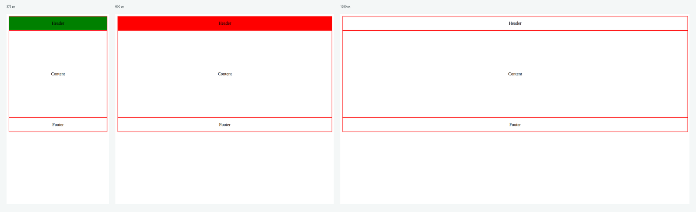
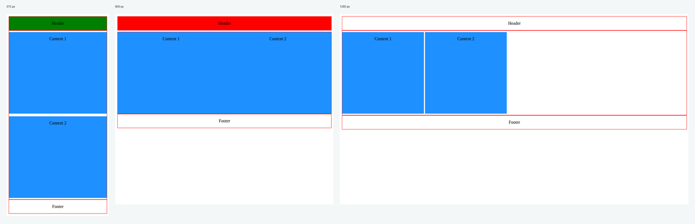
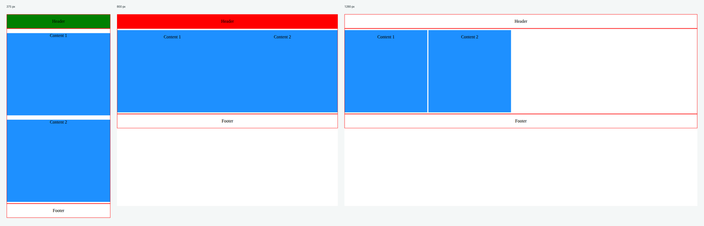
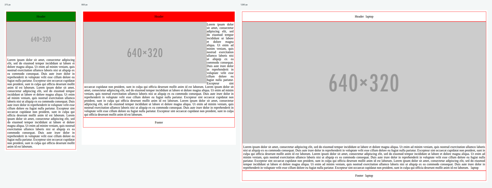
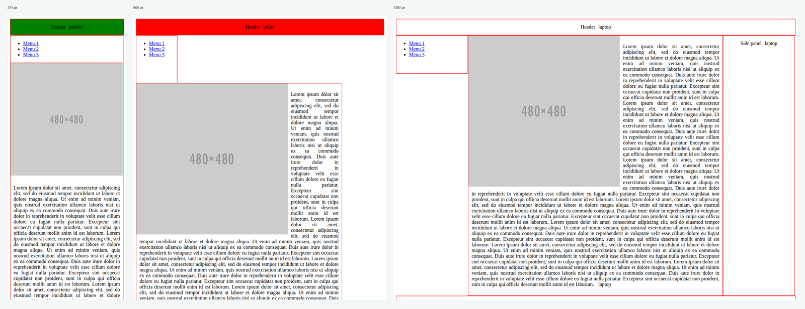

# responsive-breakpoints-lab

Five small pages, five stylesheets, one subject: media queries. Plain HTML and
CSS, no framework and no JavaScript. The pages keep their teaching skin on
purpose, red outlines on every box and a header that turns green, red or plain
depending on the range in force, so the breakpoint being applied is visible at
a glance instead of having to be inferred.

Three ranges throughout: phone up to 639.98 px, tablet from 640 px to
959.98 px, desktop from 960 px. Exercise 4 uses 665 px instead of 640 px.

## The defect this lab is really about

`max-width: 640px` and `min-width: 640px` are both true at exactly 640 px. A
page written that way has two ranges active at that width, and whichever block
comes last in the file wins. Measured in the browser, on the header colour that
serves as the witness:

| Width | Before | After |
| --- | --- | --- |
| 639 px | phone | phone |
| 640 px | tablet, the phone range never showed | phone |
| 959 px | tablet | tablet |
| 960 px | tablet, over the desktop rules | desktop |

The fix is to close each range just below the next one's start, `max-width:
639.98px`, rather than to reorder the blocks and hope. Fractional pixels are
what the CSS working group recommends here, because a device pixel ratio can
land the viewport on a fractional value.

## The five exercises

### 1. One centred block



A single content block, centred with Flexbox. The shared rule that used to be
repeated inside all three media queries now sits once at the top, which is what
made the file readable enough to see the range bug in the first place.

### 2. Two blocks, three flows



The same two blocks stack on a phone, split the row in half on a tablet, and
become two fixed 300 px cards on a desktop. Three different mechanisms for the
same markup: `inline-block`, then Flexbox, then `inline-block` again at a fixed
width.

### 3. The same page, written mobile first



Base rules are the phone layout, and each range above only declares what
changes. The tablet range floats the two blocks, so `main` gets
`display: flow-root` to contain them and keep the footer below.

### 4. Image, text, and a footer that leaves



The footer is hidden below 665 px through a `no-mobile` class, the image goes
full width on a phone and floats beside the text on a tablet. `flow-root` again
on the container, so the paragraph does not wrap around a float it was never
meant to.

### 5. Three panels



Menu, content and side panel. Stacked on a phone, menu plus content on a tablet
with the side panel pushed to its own row, and three columns at 18, 64 and 18
per cent on a laptop. The panels are laid out with Flexbox, so the `float` that
was sitting on the menu panel was doing nothing and is gone.

## What else was fixed

- `<meta http-equiv="X-UA-Compatible" content="IE=edge">` removed from all five
  pages. Internet Explorer was retired in June 2022.
- `lang` added to every `<html>`. Without it a screen reader guesses the
  language and can read the page in the wrong voice.
- `alt` added to both images.
- The menu in exercise 5 was three lists of one item each, announced as three
  lists. It is now one list of three.
- Rules repeated identically inside several media queries were hoisted to the
  base, without changing what the pages render.

## Structure

```
no1.html … no5.html    the five pages
css/style1.css …       one stylesheet per page
images/                two placeholder images
```

## Running it

No build step and no dependency. Clone the repository and open any of the five
pages in a browser, or serve the folder:

```bash
python -m http.server 8000
```

Then resize the window across 640 px and 960 px and watch the header colour.

## Stack

HTML5, CSS3, media queries, Flexbox. No framework, no JavaScript, no external
asset.

## Résumé

Cinq pages consacrées aux media queries, avec la peau pédagogique d'origine:
contours rouges et en tête coloré selon le palier, pour que le palier actif se
voie du premier coup d'œil. Le vrai défaut corrigé ici est le chevauchement des
paliers: `max-width: 640px` et `min-width: 640px` sont tous deux vrais à
exactement 640 px, si bien que le palier mobile ne s'appliquait jamais à cette
largeur. Chaque plage se ferme maintenant juste sous le début de la suivante.
S'y ajoutent la suppression du meta Internet Explorer, l'ajout de `lang` et des
`alt`, la réparation du menu en liste unique, la mise sous `flow-root` des
conteneurs à flottants, et la déduplication des règles répétées dans chaque
media query.

## Licence

MIT. See [LICENSE](LICENSE).
